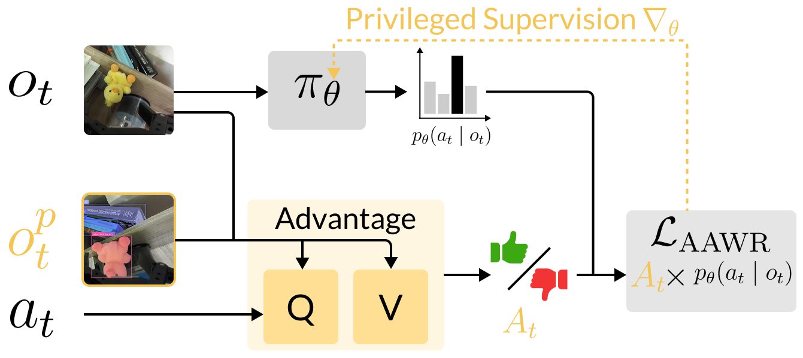

# Real-world RL of Active Perception Behaviors

NeurIPS 2025 & [ARLET Workshop](https://arlet-workshop.github.io/)

[Edward S. Hu](https://www.edwardshu.com/)\*, [Jie Wang](https://everloom-129.github.io/)\*, [Xingfang Yuan](https://www.linkedin.com/in/xingfang-yuan/)\*, [Fiona Luo](https://www.linkedin.com/in/fionalluo/), [Muyao Li](https://www.linkedin.com/in/muyao-lilian-li-04750228a/), [Gaspard Lambrechts](https://people.montefiore.uliege.be/lambrechts/), [Oleh Rybkin](https://people.eecs.berkeley.edu/~oleh/), [Dinesh Jayaraman](https://www.seas.upenn.edu/~dineshj/)

This is the official implementation of the **[Asymmetric Advantage Weighted Regression (AAWR)](https://penn-pal-lab.github.io/aawr)** RL algorithm. AAWR enables efficient online / offline RL in the real world to learn active perception policies.



The key idea is to use privileged sensors during training time to learn high-quality value functions, which are used to compute advantage weights for a weighted BC loss. This leads to better policy extraction in POMDPs compared to BC and unprivileged AWR. With just 50 demos, AAWR policies outperform BC and AWR in search quality, speed, and success rate in real world active perception tasks.

- [Paper](https://openreview.net/forum?id=RkdTtznSAL)
- [Website](https://penn-pal-lab.github.io/aawr/)

## Repo Structure
The algorithm is in `src/algorithm/asym_awr.py` where we use IQL to train a privileged Q and V  network and do AWR policy extraction. The offline and online RL training is in `src/train_il.py`.

## Setup
Here, we show you how to get AAWR up and running for a toy simulated task.

1. Install python dependencies. You can refer to the `environment.yaml` file, or just manually install the dependencies. There's not too many, mainly `torch`, `gymnasium` and their related packages.

2. Install the simulated xarm environment code, and generate demos
```
git@github.com:edwhu/gym-xarm.git
pip install -e .
python generate_demos.py # generate demo data.

mkdir gymnasium_xarm_lift_bc
mv buffer.pkl gymnasium_xarm_lift_bc
```

3. Train AAWR on a simple simulated lifting task.
```
python src/train_il.py agent=asym_awr modality=all task=gymnasium_xarm_lift dataset_dir=data/gymnasium_xarm_lift_bc seed=41 use_wandb=false exp_name=aawr_xarm_lift horizon=1 offline_steps=20000 train_steps=40000 lr=1e-4 grad_clip_norm=10 awr_filter=indicator expectile=0.9 A_scaling=3 save_video=true switch_awr_filter=true
```

## References and Acknowledgements
- [FOWM codebase](https://github.com/yunhaif/fowm): AAWR is built on top of the FOWM codebase

If you find our project helpful, please cite us:
```
@inproceedings{
    hu2025realworld,
    title={Real-World Reinforcement Learning of Active Perception Behaviors},
    author={Edward S. Hu and Jie Wang and Xingfang Yuan and Fiona Luo and Muyao Li and Gaspard Lambrechts and Oleh Rybkin and Dinesh Jayaraman},
    booktitle={The Thirty-ninth Annual Conference on Neural Information Processing Systems},
    year={2025},
    url={https://openreview.net/forum?id=RkdTtznSAL}
}
```
